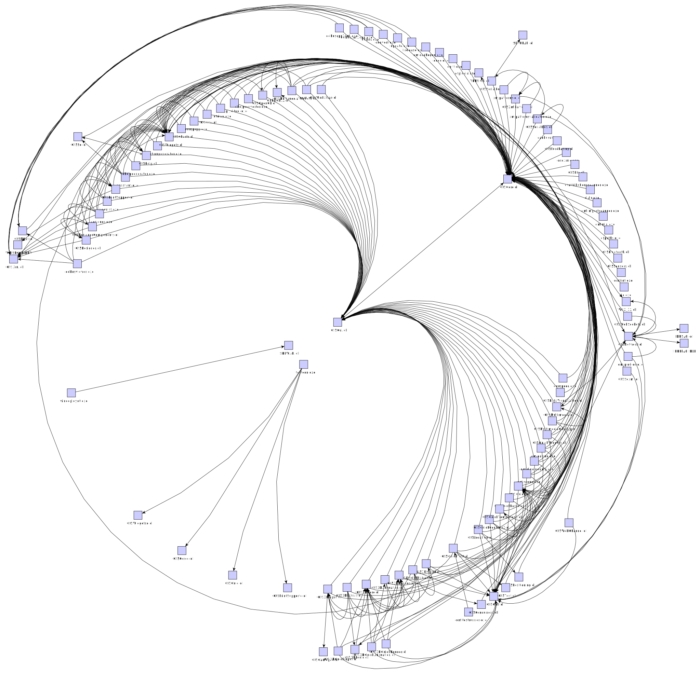

# dependents-graph

## bin-dep-graph.ps1

This script creates a dependency graph (in GraphML format) for given Windows binary files.

```PowerShell
# Examples
.\bin-dep-graph.ps1  -path c:\test  -files *.exe,*.dll
.\bin-dep-graph.ps1  -path c:\test\x,c:\test\y  -files *.dll  -filter *d.dll
```
### Example of dependents graph for [Qt5][1]

1. Create graph using `bin-dep-graph.ps1` script:

```PowerShell
 .\bin-dep-graph.ps1 -path C:\Dev\Libs\Qt5\bin -file *.dll,*.exe -filter *d.dll,*d.exe
```

2. Open `.graphml` result file in an any app that supports it, for example, in [yEd][2]

3. Select a layout to reorder nodes




[1]: https://www.qt.io/  "Qt5 Framework"
[2]: https://www.yworks.com/products/yed  "yEd Graph Editor"
